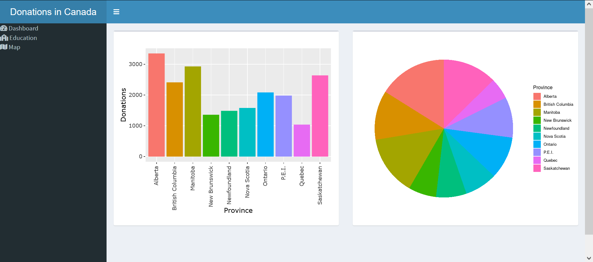

In a previous post, I explore the Flex dashboard library for the creation of a clean and interactive dashboard. That post can be found [here](https://datasandbox.netlify.app/post/2022-03-10-creating-dashboard-in-r/). Unknown to me at the time, but I sort of skipped over the more natural progression of creating a dashboard with R Shiny. This is my attempt to recreate that dashboard and compare the ease of creation and functionality of the `Shinydashboard` library.

## Application Structure

My shiny dashboard will at heart be a shiny application. I will use the single App file structure rather than the separate UI/Server file structure. The R Studio site has a very good outline on the basic structure for a [Shiny Dashboard](https://rstudio.github.io/shinydashboard/get_started.html). 

MY application will then be broken down into the following structure:

* Data Collection
* Plot Creation
* UI 
* Server

Before starting to write the Shiny App, the raw data needs to be cleaned and setup to increase application performance. 

## Data Preparation

The data is the same from the previous dashboard, which was the level of donations for Canadians to charities. The raw data can be found [here](https://open.canada.ca/data/en/dataset/74c77af4-73c4-4e0d-ac5d-f74a247cdf12). 

The following code is used to clean up the raw data and *is not* included in the Shiny App. This code is just used to create an RDS file (compressed data file) that the Shiny App will more easily load. 

```{r cleanup, eval=FALSE}
library(tidyverse)
# Download the data and unzip
download.file("https://www150.statcan.gc.ca/n1/tbl/csv/45100007-eng.zip", "donordata.zip")
unzip("donordata.zip")

# Read the data into R
data = read_csv("45100007.csv")

# Clean up the data
data = data %>%
        filter(`Donation statistics (UOM)`=='Average annual donations') %>%
        filter(!GEO=="Canada") %>%
        filter(!Education == "All education levels") %>% rename(Province = GEO)
data$Province[data$Province == "Newfoundland and Labrador"] <- "Newfoundland"
data$Province[data$Province == "Prince Edward Island"] <- "P.E.I."

# Saved the clean data as an RDS file
saveRDS(data, 'data.rds')
```

## Data Collection

With the data preparation completed, we can now start with writing the application. Shiny Application can be broken down to two parts, reactive and nonreactive. It is important to keep our calculations in the nonreactive part if their values do not change because it will be very demanding on system resources otherwise.

```{r data_collection, message=FALSE, warning=FALSE}
# Loading the libraries
library(shiny)
library(shinydashboard)
library(plotly)
library(tidyverse)
library(leaflet)
library(rgdal)
library(gt)

# Data is loaded into the shiny app from the previously generated RDS file
data = readRDS('data.rds')

# Summary data is created from the loaded data and saved as data2
data2 <- data %>%
        group_by(Province) %>%
        summarise(Donations = sum(VALUE))

# For regional information for mapping, the rgdal library is used.
library(rgdal)

# The following code will download a regional outlines for maps if the file doesn't exist on the system 
if (!file.exists("./src/ref/ne_50m_admin_1_states_provinces_lakes/ne_50m_admin_1_states_provinces_lakes.dbf")){
        download.file(file.path('https://www.naturalearthdata.com/http/',
                                'www.naturalearthdata.com/download/50m/cultural',
                                'ne_50m_admin_1_states_provinces_lakes.zip'), 
                      f <- tempfile())
        unzip(f, exdir = "./src/ref/ne_50m_admin_1_states_provinces_lakes")
        rm(f)
}

# The regional data is then loaded into R and some data is edited to make it more inline with the regional data
region <- readOGR("./src/ref/ne_50m_admin_1_states_provinces_lakes", 'ne_50m_admin_1_states_provinces_lakes', encoding='UTF-8', verbose = FALSE
                  )
data2$Province <- c("Alberta", "British Columbia", "Manitoba", "New Brunswick", "Newfoundland and Labrador", "Nova Scotia", "Ontario", "Prince Edward Island", "Québec", "Saskatchewan")

```

## Plot Creation

Just as the data was collected in the nonreactive section, so should the plot creations. This doesn't mean that the plots won't be interactive, just that their designs will remain static.

```{r plots}
bar_plot <- data %>%
        group_by(Province) %>%
        summarise(Donations = sum(VALUE)) %>%
        ggplot(aes(x = Province, y = Donations, fill = Province)) +
        geom_bar(stat = "identity", show.legend = FALSE) +
        theme(axis.text.x = element_text(angle = 90), legend.position='none')

# This call was added for illustration
bar_plot

edu_plot <- data %>%
        group_by(Education) %>%
        rename(Donations = VALUE) %>%
        ggplot(aes(y= Donations, x = Education, fill = Education)) +
        geom_boxplot() +
        theme(axis.title.x=element_blank(),
              axis.text.x=element_blank(),
              axis.ticks.x=element_blank())

# This call was added for illustration
edu_plot

pie_plot <- data %>%
        group_by(Province) %>%
        summarise(Donations = sum(VALUE)) %>%
        ggplot(aes(x = '', y = Donations, fill = Province)) +
        geom_bar(stat = "identity", width = 1) +
        coord_polar("y", start = 0) +
        theme_void()

# This call was added for illustration
pie_plot

map_leaf <- leaflet() %>% 
        addTiles() %>% 
        setView(-74.09, 45.7,  zoom = 2) %>% 
        addPolygons(data = subset(region, name %in% data2$Province), color = "#444444", opacity = 1.0, fillOpacity = 0.75,
                    fillColor = ~colorQuantile("Greens", data2$Donations)(data2$Donations),
                    weight = 1)

# This call was added for illustration
map_leaf

gt_table <- data2 %>% 
        pivot_wider(names_from = Province, values_from = Donations) %>%
        gt()

# This call was added for illustration
gt_table

```

## UI

The following code creates the UI interface that the user interacts with. For those familiar to Shiny Apps, the structure will be similar. The actual functions used will be different, but usually their names will just have the 'dashboard' prefix. For those not familiar with Shiny Apps, the UI is created by a nesting of a series of functions. The notation can get a little difficult as you need to remember to use ',' when passing multiple functions. Though not used in this dashboard, UI interfaces can be used to control elements of the display. These controls create variables that need to be saved as `input$"variable_name"`. This allows the transfer of information from the UI to the server side. Likewise, plots and figures from the server side need to be saved as `output$"variable_name"`. When an output variable is referenced in the UI, such as the `plotOutput` function for displaying plots, they are referenced as "variable_name" in quotes. 

Again, the syntax can be difficult to learn and use, but the R Studio post on [Shiny Dashboards](https://rstudio.github.io/shinydashboard/get_started.html) provide the basic skeleton to learn from. My biggest issue is keeping track of all the ')' and ',' used.  

```{r ui, eval=FALSE}
# The main page structure is the dashboardPage
ui <- dashboardPage(
        
# The header is simple the header for the dashboard
        dashboardHeader(title = "Donations in Canada Dashboard"),

# The sidebar functions adds the controls for flipping through dashboard pages        
        dashboardSidebar(
                
# Each menu item is a link that will apear on the sidebar
# There are a bunch of quality icons that the icon function can return 
                menuItem("Dashboard", tabName = "gauge", icon = icon("dashboard")),
                menuItem("Education", tabName = "education", icon = icon("school")),
                menuItem("Map", tabName = "map", icon = icon("map"))),
        
# The next section includes the body or the main section of the dashboard
        dashboardBody(
# In the main body, each of the tabs in the side bar need to be referenced. The tabItems function is the container for all the tabs
                tabItems(
                        
# Each previous mentioned tab, will have a separate tabItem.
                        tabItem(tabName = "dashboard",

# The fluidRow function is used to align the elements on the page. Through trial and error, I have found this to be the element for changing the size of plots.
                                fluidRow(
                                        
# A box is drawn around each plot. Each plot/figure/element is referenced here with the plotOutput function or a likewise function. In the server side, I will transform the ggplots into plotly plots to create interactive plots so the plotlyOutput function is used. 
                box(plotlyOutput("plot1"), width = 6),
                
# The pie plot is a regular ggplot object, so it can be passed to the plotOutput function
                box(plotOutput("pie"), width = 6))),
                
                tabItem(tabName = "education",
                        fluidRow(
                                box(plotlyOutput("plot3"), width = 12))),
                
# For the map tab, the leafletOutput function is used to display the leaflet map created in the server side. 
                tabItem(tabName = "map", 
                        fluidRow(
                                box(leafletOutput("plot2"), width = 8)
                                ),
                        
# On a second row, under the map, a GT table requires the gt_output function
                        fluidRow(
                                box(gt_output("table"), width = 12)
                        ),
                        )
                )
        )
)
```

## Server

The server is the second major function in the Shiny App. Rather than using the output series of functions, it requires the paired version of the render function. Any controls from the UI would need to be passed as part of the `input` variable. 

```{r server, eval=FALSE}
# The same structure for any other Shiny App
server <- function(input, output) {

# Any data to pass back to the UI, such as figures or plots, will need to be saved as part of the output. Anything within the {} brackets becomes an interactive element. If they are not present, the plot will not change.
        output$plot1 <- renderPlotly({
                
# The ggplot for the barplot is converted to an interactive plotly plot.
                        ggplotly(bar_plot)
                })

        output$plot2 <- renderLeaflet({map_leaf})
        
        output$plot3 <- renderPlotly({ggplotly(edu_plot)})
        
# The GT table requires the render_gt function which pairs with the gt_output function in the UI.
        output$table <- render_gt({gt_table})
        
        output$pie <- renderPlot({pie_plot})
}
```

## Finalized Dashboard

The finalized dashboard looks pretty good. The sidebar adds a good level of control to the user and makes the data better organized. I also enjoy the default styling, but I'm sure it can be changed.

When compared to the dashboard created with `flexdashboard`, it is much nicer looking. The flex dashboard, however, has the advantage of being much easier to create with r markdown. It is also much more flexible as it produces an HTML file which is easy to manage. The shiny dashboard needs to be hosted, which makes it slightly clunky. 

Speaking of the clunky nature of Shiny Apps, you also need to be conscious of what needs to be reactive and what doesn't. It is very easy to slow down a Shiny Dashboard with a bunch of unnecessary calculations. The writing of the application itself is also quite clunky. It doesn't compare to the ease of writing in R markdown. 

So which dashboard do I prefer? Well I think for a quick solution, flex dashboard is great but the amount of control and styling of a shiny dashboard is just better. I do think that there is a place for both, but if I had to choose, I would go for a Shiny Dashboard. 

```{r demo1, echo=FALSE, message=FALSE, warning=FALSE}
htmltools::tags$iframe(title = "Shiny Dashboard", width = "100%", height = 500, src= "https://m2edney.shinyapps.io/ShinyDashboard/")
```