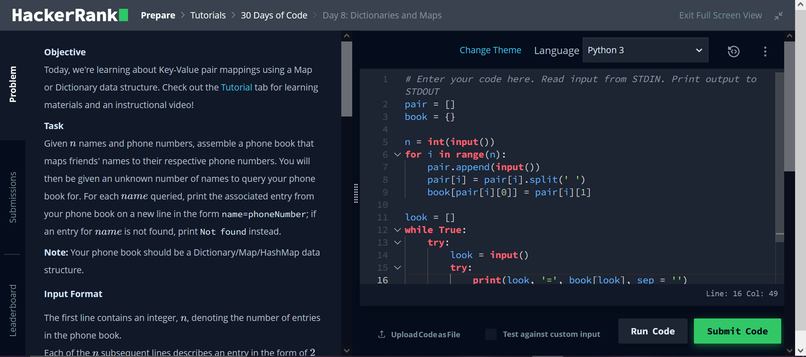

How do you become a better programmer? Well, there is strong scientific evidence for the support of the principle of deliberate practice. Deliberate practice is a method of skill development first written by Anders Ericsson in the book "Peak: Secrets from the New Science of Expertise". I would also recommend reading "Talent Is Overrated: What Really Separates World-Class Performers from Everybody Else" by Geoff Colvin.

## Deliberate Practice

Deliberate Practice can be summarized to the following points:

* Talent is not enough, and to become great at a task requires a lot of practice and repetition.

* Deliberate practice is hard-work, in order strengthen your skills through practice you need to be challenged. This means that repetition by itself will not develop skill. This also means you need to constantly increase the challenge of your practice as you become better at it. 

* Focus plays a large role in deliberate practice. This connects to the previous point for the required challenge of practice. This can also tie into the principles of flow, as best described by Mihaly Csikszentmihalyi in his book "Flow: The Psychology of Optimal Experience".

* Setting goals becomes a powerful motivator. With the completion of a goal, there is a release of endorphins, which cause a sense of satisfaction. Goals are can also be utilized to increase the difficulty of practice, making an otherwise easy task a challenge.

* Feedback is important. Feedback provides motivation by comparing current to previous performance. 

## Application for programmers

So, how can programmers incorporate the principles of deliberate practice? I've recently been recommended the site [Hacker Rank](https://www.hackerrank.com) and I can say it is fantastic.
The Hacker Rank site provides a wide array of challenges for programmers of varying skills levels. There is a selection of different topics from Algorithms to Regular Expressions.

So how does Hacker Rank fit in with deliberate practice? Well, there certainly are a good level of challenges to work through. There a three different levels per topic, with challenges in the same difficulty having nothing in common. 

The design of the site is quite simple, with very little to distract you from your challenge. There is the option for a dark theme if you are, like me, a person of sophistication. It also pretty easy to have the problem on one side of your screen with your programming on the other.

There are multiple built-in goals to work on. Certifications for each topic to test your current skill level and to advertise to potential employers. There a preparation kits for interviews with time frames between 1 and 12 weeks, which ever is most convenient for you.

There is immediate feedback from assignments, with automated program testing. A leader board is provided for the most competitive, who are interested in their global ranking. You also get feedback from the built-in IDE on your programming errors. 

## Site Criticisms

I do enjoy the site, but I still have some minor issues. To its credit, the site does support multiple programming languages, even different versions of the same programming language. This does, however, make it difficult to following along with the tutorials if they are done in a language that you are not familiar with. 

Also, at this time, there doesn't seem to be support to retake certification exams for some topics. I myself, had failed the R basic certification as I am more used to using the `tidyverse` package rather than base `R`. 

I can't really speak on behalf of the incorporation of potential employers in it. But that does seem like a very promising idea. I still think it is a great to tool for the programming community, and I will continue to utilize it for my personal skill development, as it can easily provide a source of deliberate practice.  
