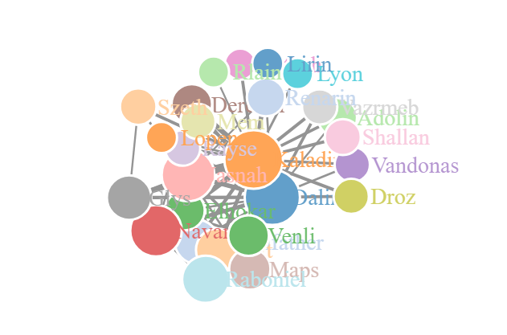

## Introduction
Network graphs are an important tool for network analysis. They illustrate points, referred to as nodes, with connecting lines, referred to as edges. Since network graphs are such useful tools, there are many options for graph generation. In this posting, I will demonstrate three different techniques for developing network graphs in `r`. 

This is part 3 of a series which is based on the **Stormlight Archive** by Brandon Sanderson. This project was originally inspired by the work of [Thu Vu](https://www.youtube.com/watch?v=RuNolAh_4bU) where she created a network mapping of the characters in the Witcher series.

In the first part of the project, we scrapped the Coopermind website to create a verified character name list. This scrapping was performed with the `rvest` package. The list was then cleaned up and saved for further use. 

For the second part of the project, we read through and analyzed the four books that make up the **Stormlight Archive** series. The books were read into memory with the `readtext` package, which fed nicely into the `quanteda` to create the body of text called a Corpus. Unfortunately, the body of text was so big that we were unable to model all the text, so we divided the Corpus up into smaller documents with the `rainette` package.

With the corpus finally prepped, we feed it into the `spacyr` package, a frontend for the `spaCy` `python` library, to identify the entities. We were able to create a table identifying the entities that were people and filter it by the verified character list. We created a moving window model that would create a connection between two named characters if they were both mentioned within the same window. By aggregating the results of this model, we developed the foundation for a network graph.

## Initialization
The first step of this process is to load in the necessary packages for the graph generation. The `Tidyverse` package is always useful for analysis, so I've loaded it too. I have read that the different graph packages can interrupt each other, requiring one of them to be loaded at a time. I have not found this to be an issue. 

```{r initial, warning=FALSE, message=FALSE}
library(tidyverse)
library(igraph)
library(ggraph)
library(networkD3)
```

The next step is to load in the data that we created in part two of the project. This data represents that relationship between all the verified characters as read through the series of books. Saving and loading data in RDS format is much more convenient than the CSV format, as RDS files are compressed and seem to load faster.  

```{r load}
data <- read_rds("StormGraph.RDS")
```

## IGraph
The first package to explore is the `igraph` package. This package is not only for plotting graphs, but also includes many tools for network analysis. For our data, we can create a simple network graph with the `graph_from_data_frame` function. The relationships are not directional, so we pass this information to the function. The graph can then be plotted with the `plot` function. 

```{r graph}
graph <- graph_from_data_frame(data, directed = FALSE)
plot(graph)
```

The graph created is a mess. There are way too many character nodes and way too many relationships created. We need to create a smaller dataset to reduce the amount of information. I reduced the size of the data by taking only the top 98% quantile in relationships. Since the data is stored as a data table, the data table notation is used to create a subset.  

```{r smaller}
data2 <- data[data$N >= quantile(data$N, p = 0.98),,]
data2 %>%
        graph_from_data_frame(directed = FALSE) %>%
        plot(layout = layout_with_graphopt)
```

The plot created is still difficult to understand, but it much more reasonable. I feel the `igraph` package is best for graph analysis and exploratory plots. For a more attractive plot, we need to move on to the next package. 

## Tidygraph and GGraph
The `tidygraph` and `ggraph` packages seek to create graphs in the tidyverse-like environment. 
```{r tidygg, warning=FALSE,message=FALSE}
library(tidygraph)
```
Creating a graph with `ggraph` requires more structure than the previous `igraph`. The graph requires two data frames, one for nodes and one for edges.

For the nodes dataframe, we need a list of all the node names and an ID number for each node. This is achieved by finding the unique values within both columns of data. These values are then passed to the tibble function to create a tibble, a data structure similar to data frames, and then a column for IDs is created with the `rowid_to_column` function. 
```{r tidydata}
nodes <- c(data2$Person1, data2$Person2) %>% 
        unique() %>%
        tibble(label = .) %>%
        rowid_to_column("id")
```

For the edges dataframe, we need some additional steps. As a reminder, in our subset of data, we have rows with two names and a number to represent the strength of their bond. The character names need to in the form of the node IDs rather than the names. This task is completed with two merges with the node dataframe. The graph can then be created with the `tbl_graph` function.   
```{r edges}
edges <- data2 %>%
        left_join(nodes, by = c("Person1"="label")) %>%
        rename(from = "id") %>%
        left_join(nodes, by = c("Person2"="label")) %>%
        rename("to" = "id") %>%
        select(from, to, N)

graph_tidy <- tbl_graph(nodes = nodes, edges = edges, directed = FALSE)
```

For the plotting of the graph, we use the `ggraph` library. With this package, the graph can act as any other `ggplot` geom. With an extra step, we can create a centrality feature in our graph. There are a bunch of different centrality measures, but they all represent the level of importance of a node. 
```{r ggraph}
graph_tidy %>%
        mutate(Centrality = centrality_authority()) %>%
        ggraph(layout = "graphopt") + 
        geom_node_point(aes(size=Centrality, colour = label), show.legend = FALSE) +
        geom_edge_link(aes(width = N), alpha = 0.8, show.legend = FALSE) + 
        scale_edge_width(range = c(0.2, 2)) +
        geom_node_text(aes(label = label), repel = TRUE)
```

## Network D3

The `ggraph` has created a better looking plot with a much higher level of customization. It is however a static plot with no level of interaction. I have tried using the `ggplotly` function from the `plotly` package it make it more interactive, but many of the `ggraph` features are not supported. 

To create an interactive plot, we move to the `networkD3` package. This package is based on the `D3` JavaScript library to create interactive plots. We can use the same nodes and edges data frames from the `ggraph` plot. This process does require one adjustment to the node IDs, as the package requires an initial ID of 0 rather than the default `r` index of 1. 

The function from the `tidygraph`, `centrality_authority`, is only supported for the tidygraph data structure, so we need an alternative function to use with our data frame. This is achieved with the `authority.score` function from the `igraph` package. Besides that, we normalize the edge width values, node sizes and set all the parameters for the `forceNetwork` function.  

```{r graph2, message=FALSE, warning=FALSE}
edges <- edges %>%
        mutate(from = from -1, to = to - 1) %>%
        mutate(N = N / 200)

nodes <- nodes %>%
        mutate(id=id-1) %>%
        mutate(nodesize = authority.score(graph_tidy)$vector*150)
        
forceNetwork(Links = edges, Nodes = nodes, Source = "from", Target = "to", NodeID = "label", Group = "id", opacity = 1, fontSize = 14, zoom = TRUE, Value = "N", Nodesize = "nodesize", opacityNoHover = TRUE)

```