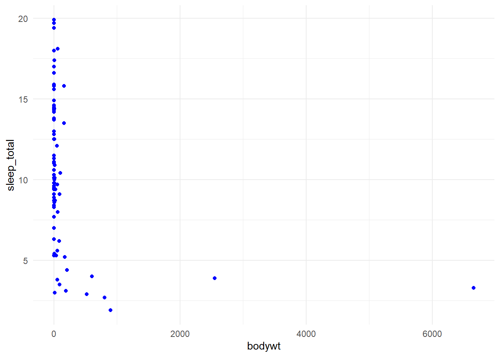
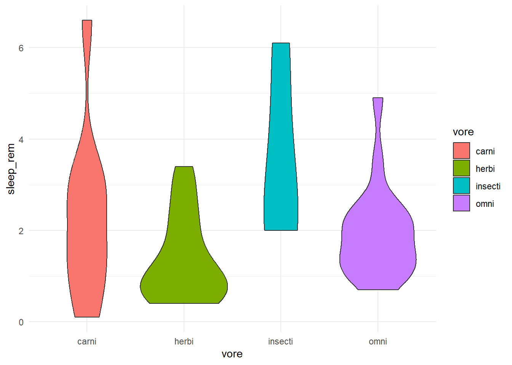

## Introduction

RMarkdown has been a staple for any Data Scientist that programs in `R`. `Quarto` builds on that, with multiple language support and additional features. Because of its language independent design, `Quarto` requires an independent installation. [@quarto]

I have spent the past week moving my blog from `blogdown` to `quarto`. There have been some challenges, but I am pretty happy with the new look. Let's start with the setup, it's a little more work than a regular package or module.

## Setup

The setup for Quarto is pretty simple. You will need to visit the quarto website to [download](https://quarto.org/docs/get-started/) the Quarto Command Line Interface (CLI). There are step-by-step instructions for your selected text editor. I am most familiar with RStudio for `R` and VSCode for `Python`.

For Rstudio, it's pretty much just plug and play now. I did install the `Quarto` package, but all the commands can be done by the command line interface. Switching from `RMarkdown` is as simple as saving them as `qmd` file. The process for Quarto for RStudio can be described by the following process flow:


It is not much more difficult for VSCode, all you need to do is download the Quarto extension. The process flow is similar to RStudio but uses Jupyter instead of knitr.


With the setup complete, there should be no differences between text editors.

## Code Chunk Options

The first new feature to explore the support for code chuck options within the code chunks. These options would usually live within the code chunk title line. Any supported option can be added with the `#|` tag. This feature is useful for situations with many options, as it does increase readability.


````markdown
```{{r}}
#| label: load
#| include: true
#| warning: false

library(tidyverse)
data("msleep")
```

````


## Code-folding

One of the neat new features is code-folding. When this feature is enabled in the qmd YAML, the person viewing the document can hide/unhide code chunks. This can make it easier for them to read the document. Only the code will be hidden, and not the results.

::: {.cell}

```{.r .cell-code}
glimpse(msleep)
```
:::

This feature is enabled by making the following addition to the YAML. You would change the format from HTML to your required format, such as PDF.

::: {.cell}

```{.r .cell-code}
format: 
  html: 
    code-fold: true
    code-tools: true
```
:::

With the addition of the `code-tools: true` parameter, the reader can decide to hide all code chunks from the top of the document.

## Figures

Quarto provides a bunch of additional tools for displaying figures. You can assign values for captions, sub-captions, width and height. You can even create a figure with multiple plots with separate sub-captions.


````markdown
```{r}
#| label: fig-sleep
#| fig-cap: "Sleeping habits of animals"
#| fig-subcap:
#|   - "Scatter plot of body weight by total sleep"
#|   - "Violin plot of REM sleep by vore"
#| layout-ncol: 2

msleep %>%
  drop_na(sleep_total, bodywt) %>%
  ggplot(aes(y= sleep_total, x = bodywt)) +
  geom_point(color = "blue") +
  theme_minimal()

msleep %>%
  group_by(vore) %>%
  drop_na(sleep_rem, vore) %>%
  ggplot(aes(y= sleep_rem, x = vore)) +
  geom_violin(aes(fill = vore)) +
  theme_minimal()
```
````


::: {#fig-sleep .cell layout-ncol="2"}
::: {.cell-output-display}
{#fig-sleep-1 width=672}
:::

::: {.cell-output-display}
{#fig-sleep-2 width=672}
:::

Sleeping habits of animals
:::


You can now use cross-referencing for the figure by referencing the figure. This means that in your text, you can refer to the figure number and link to the figure. This will automatically update your figure numbers and is achieved by typing the '\@' symbol followed by the figure label. As an example, '\@fig-sleep' turns into @fig-sleep.

There is an additional option to let the figures take up the width of the entire page, but I would not recommend using it as it extends beyond the width of the body of your page. It requires the following code:


````markdown
```{r}
#| column: page
```

````

## Code Linking

A reader may not be familiar with all the functions that you use in your document, so it may be useful to enable code linking. With code linking, a function in a code chunk will have a hyperlink to the documentation for that function. To work in `R`, this feature requires the `xml2` and `downlit` packages.

::: {.cell}

```{.r .cell-code}
lm(as.factor(order) ~ sleep_total, data = msleep[complete.cases(msleep),] )
```
:::

## Table of contents

I think the best feature for `Quarto` is the floating table of contents. I can't describe how much time and effort I've spent trying to get a floating table of contents in a `Blogdown` blog. It didn't work for me, it would require getting deep into the weeds changing the CSS layout for my HUGO theme. It was not worth the effort.

Adding a floating table of contents in `Quarto` is simple. Just use the following code in the document YAML:

::: {.cell}

```{.r .cell-code}
toc: TRUE
```
:::

One simple line of code in the YAML and your document has a floating table of contents. There is some additional customization such as the level of headers, location and title.

::: {.cell}

```{.r .cell-code}
toc: true
toc-depth: 2
toc-location: left
toc-title: Contents
```
:::

## Quarto vs Blogdown

With my experimentation with Quarto, I decided to move my `blogdown` blog to `Quarto`. In theory, this should be a simple switch, with just copying all post from folder to another. `Quarto` can use rmd files, but they can easily be changed over to qmd files. I decided to switch all my post to the qmd format and include some additional features. The Quarto site has extensive reference information for creating a blog. [@quarto-]

I did have an issue with one of my post not rendering correctly. This maybe an issue with compatibility with the `stargazer` package. In the end, I decided to just remove the post altogether as I could get it to render correctly, and I prefer the `gt` over the `stargazer` package for creating good-looking tables.

## Conclusion

It is easy to create great looking documents using `quarto`, whether that be with code in `python` or `R`. `Quarto` supports most of the features in `RMarkdown` with some fancy new ones. My personal favourite is the floating table of contents. I have also found that rendering a `Quarto` blog is a much smoother experience than rendering a `blogdown` blog.

